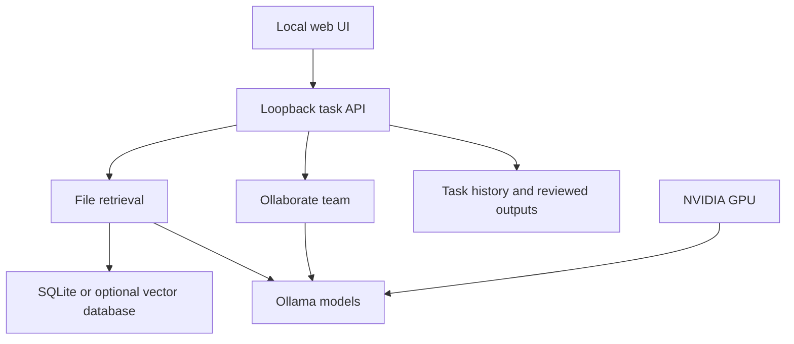

# Local architecture

Only the local process connects to Ollama on the loopback interface. The source folder is read during indexing. SQLite lexical search works by default; LibreIndex adds semantic retrieval when separately installed. The task runner receives snippets, paths, and LibreIndex's grounded answer. Ollaborate's planner and writer then produce a draft. The user decides whether to save it. The index, task history, and saved drafts live under `OLL_DESK_DATA`.

Future action plugins must declare resource scope and read/write permissions. A policy gateway must validate paths and arguments before an agent's tool call, show a diff for changes, record the decision, and provide a reversible checkpoint. Network access should be denied in offline mode at the process or OS boundary; prompt instructions alone are insufficient isolation. A browser plugin should be explicitly scoped to local pages or approved intranet hosts.
